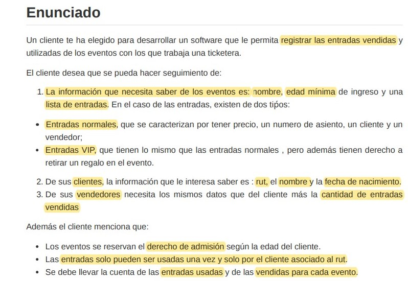

# Ticketera | Ignacio Cavallo. 
<!-- markdownlint-capture -->


## Solución

Dividí el problema, en las siguientes clases:
* **Cliente**
* **Vendedor**
* **Entrada**
* **Evento**
* **Entrada**
* **Entrada Vip**
* **Venta**

la implementación se basa en dos pilares, uno es el Evento y el otro es la Venta.
El **Evento** define el precio de la entrada(normal o vip), la edad mínima, un listado de entradas vendidas y como también definir si el evento esta en curso o no.  
Por otra parte, la Clase **Venta** es una clase de apoyo y realiza gran parte de la lógica del programa. Es la que realiza la venta de una entrada y hace el nexo entre *Entrada, Cliente, Vendedor y Evento*. Esta realiza los check necesarios para poder concretar la venta:

1. Hace un check de la edad.  

2. Check que el número de asiento no esté vendido.  

3. Si todo esto esta OK, procede a realizar la venta en función si del tipo de entrada.
   1. Si es VIP, genera una nueva EntradaVip en función al Evento(esto define el precio) que la agrega al listado de entradas, se la asigna al cliente en forma de entrada y suma en una variable de clase la cantidad total de entradas Vip vendidas.  

   2. Lo mismo ocurre en el caso de las entradas normales, salvo que genera una nueva Entrada.  

Retomando la Clase Evento, una vez generada la venta, si el ingreso del cliente se da cuando el evento NO  está en curso, tirá un aviso de que no pudo ingresar. Cuando el evento SI  esta en curso y la entrada no ha sido utilizada, entonces el cliente puede ingresar y su entrada ingresa a una lista de entradas usadas. Si este mismo cliente quiere re ingresar con la misma entrada, saltará un error avisando que esa entrada a sido Utilizado.

## Resultado - Main

```java
package com.nacho;

public class Main {

    public static void main(String[] args) {
        /* Nuevo Evento, vendedor, cliente */
        Evento concierto = new Evento("Concierto Pulenta", 18, 120);
        Vendedor juanVenta = new Vendedor("Juan Venta", "23.553.463-2");
        Cliente miguelCliente = new Cliente("Miguel Cliente", "15-557.398-1", 24);
        Cliente robertoCliente = new Cliente("Roberto Cliente", "20-123.398-1", 12);
        Cliente jamesVip = new Cliente("James VIP", "8.947.442-2", 42);
        Cliente norbertoCliente = new Cliente("Norberto", "7.698.442-2", 53);
        /*
         * Pruebas de Venta de Entrada:
         * Válida, Problema de Edad y Asiento Vendido.*/
        aviso("Venta Entrada Normal Válida");
        Venta.ventaEntrada(concierto, miguelCliente, juanVenta, false, 7);
        System.out.println();
        aviso("Venta Entrada Normal Inválida: No cumple Edad Mínima");
        Venta.ventaEntrada(concierto, robertoCliente, juanVenta, false, 8);
        aviso("Venta de Entrada con número de asiento ya Usado");
        Venta.ventaEntrada(concierto, miguelCliente, juanVenta, false, 7);
        aviso("Venta de Entrada Vip");
        Venta.ventaEntrada(concierto, jamesVip, juanVenta, true, 42);
        Venta.ventaEntrada(concierto, norbertoCliente, juanVenta, false, 23);

        /*
        Intento de Ingreso cuando el evento no Comenzó
         */
        aviso("Intento de Ingreso cuando el evento no Comenzó");

        concierto.ingresoEvento(miguelCliente.getEntrada());
        aviso("Inicio de Evento");

        concierto.inicioEvento(); // Iniciamos el Evento
        /* Ingreso al Evento en Curso */
        aviso("Ingreso al Evento");

        concierto.ingresoEvento(miguelCliente.getEntrada());
        aviso("Intento de ingresar con Entrada Usada");
        concierto.ingresoEvento(miguelCliente.getEntrada());
        /* Otros Ingresos de Clientes */

        concierto.ingresoEvento(jamesVip.getEntrada());
        concierto.ingresoEvento(norbertoCliente.getEntrada());

        aviso("Listado de Ventas Del Vendedor");
        juanVenta.listadoVentas();

        aviso("Entradas Vendidas!");
        concierto.listadoEntradas();
    }

    // Método creado para la impresión de mensajes;
    public static void aviso(String mensaje) {
        System.out.println();
        System.out.println("*** " + mensaje + " ***");
        System.out.println();
    }
}

```

## Resultado | Output

```bash
*** Venta Entrada Normal Válida ***

Entrada Vendida! 
Número de Asiento: 7 de Miguel Cliente


*** Venta Entrada Normal Inválida: No cumple Edad Mínima ***

Roberto Cliente Ud tiene: 12
Ud. no cumple la edad mínima de: 18

*** Venta de Entrada con número de asiento ya Usado ***

Este Asiento no está Disponible.

*** Venta de Entrada Vip ***

Número de Asiento: 42 de James VIP
Entrada Vendida! 
Número de Asiento: 23 de Norberto

*** Intento de Ingreso cuando el evento no Comenzó ***

Concierto Pulenta no ha comenzado!

*** Inicio de Evento ***


*** Ingreso al Evento ***


*** Ingreso al Concierto Pulenta***
Bienvenido Miguel Cliente al evento Concierto Pulenta, ud. puede pasar


*** Intento de ingresar con Entrada Usada ***

La entrada fue usada!

*** Ingreso al Concierto Pulenta***
Bienvenido James VIP al evento Concierto Pulenta, ud. puede pasar


*** Ingreso al Concierto Pulenta***
Bienvenido Norberto al evento Concierto Pulenta, ud. puede pasar


*** Listado de Ventas Del Vendedor ***

Juan Venta ha vendido: 
Entradas Normales: 2
Entradas Vip: 1
El total vendido es de: 3

*** Entradas Vendidas! ***


Entrada número: 7
Cliente: Miguel Cliente
Vendedor: Juan Venta


Entrada número: 42
Cliente: James VIP
Vendedor: Juan Venta


Entrada número: 23
Cliente: Norberto
Vendedor: Juan Venta

```

### Evento  
Lo destacado en esta clases es que se le asocia una Entrada a la instancia de cliente.
```java
public class Evento {
    private String nombre;
    private int edadMinima;
    private double precio;
    private double precioVip;
    private boolean enCurso;
    private ArrayList<Entrada> entradasVendidas;
    private ArrayList<Entrada> entradasUsadas;

    public Evento(String nombre, int edadMinima, double precio) {
        this.nombre = nombre;
        this.edadMinima = edadMinima;
        this.entradasVendidas = new ArrayList<>();
        this.entradasUsadas = new ArrayList<>();
        this.precio = precio;
        this.precioVip = precio*1.5;
        this.enCurso = false;


    }

    public void agregarEntradaVendida(Entrada entrada) {
        entradasVendidas.add(entrada);
    }


    public void inicioEvento(){
        this.enCurso = !this.enCurso;
    }

    public void ingresoEvento(Entrada entrada){
        if(isEnCurso()) {
            if(entradasUsadas.contains(entrada)){
                System.out.println("La entrada fue usada!");

            }else{
                System.out.println();
                System.out.println("*** Ingreso al " + this.nombre + "***");
                System.out.printf("Bienvenido %s al evento %s, ud. puede pasar%n",
                        entrada.getCliente().getNombre(), this.nombre);
                System.out.println();
                entradasUsadas.add(entrada);
            }
        }else {
            System.out.println(this.nombre + " no ha comenzado!");
        }

    }
    /* ................ */
        public void listadoEntradas(){
        for(Entrada entrada:entradasVendidas){
            System.out.println();
            System.out.println("Entrada número: " + entrada.getNumeroAsiento());
            System.out.println("Cliente: " + entrada.getCliente().getNombre());
            System.out.println("Vendedor: " + entrada.getVendedor().getNombre());
            System.out.println("");
        }
    }
```

### Venta
```java
package com.nacho;

public class Venta {

    /*
    * Para vender una entrada debo checkear:
    * 1. QUe cumpla la edad mínima
    * 2. Que el n de asiento no esté vendido
    * 3. que tipo de Entrada va a comprar*/

    //1.
    private static boolean checkEdad(Evento evento, Cliente cliente){
        return cliente.getEdad()>=evento.getEdadMinima();

    }

    //2.
    private static boolean checkNumAsiento(int num, Evento evento) {
        var tf = true;
        for (Entrada e : evento.getEntradasVendidas()) {
            if (num == e.getNumeroAsiento()) {

                System.out.println("Este Asiento no está Disponible.");
                tf = false;
                break;

            }
        }
        return tf;
    }
    // Check todos los puntos anteriores.
    private static boolean checkVenta(Evento evento, Cliente cliente, int numeroAsiento){
        boolean respuesta = false;
        if(checkEdad(evento, cliente)){ // Edad

            if(checkNumAsiento(numeroAsiento, evento)){ // Num Asiento
                respuesta = true;
            }
        }else {
            System.out.println(cliente.getNombre() + " Ud tiene: " + cliente.getEdad());
            System.out.println("Ud. no cumple la edad mínima de: " + evento.getEdadMinima() );

        }return respuesta;
    }
    public static void ventaEntrada(Evento evento, Cliente cliente, Vendedor vendedor, boolean vip,
                                    int numeroAsiento) {
        var ventaOk = checkVenta(evento, cliente, numeroAsiento);
        if (ventaOk) {
            if (!vip) {
                var entradaNormal =new Entrada(evento.getPrecio(),
                        numeroAsiento, cliente, vendedor);
                evento.agregarEntradaVendida(entradaNormal);
                vendedor.ventaNormal();
                cliente.setEntrada(entradaNormal);
                System.out.println("Entrada Vendida! ");
                System.out.println("Número de Asiento: " + entradaNormal.getNumeroAsiento() +
                        " de " + entradaNormal.getCliente().getNombre());
            } else {
                var entradaVip = new EntradaVip(evento.getPrecio(),
                        numeroAsiento, cliente, vendedor);
                evento.agregarEntradaVendida(entradaVip);
                vendedor.ventaVip();
                cliente.setEntrada(entradaVip);
                System.out.println("Número de Asiento: " + entradaVip.getNumeroAsiento() +
                        " de " + entradaVip.getCliente().getNombre());
            }
            }

    }


}
```
