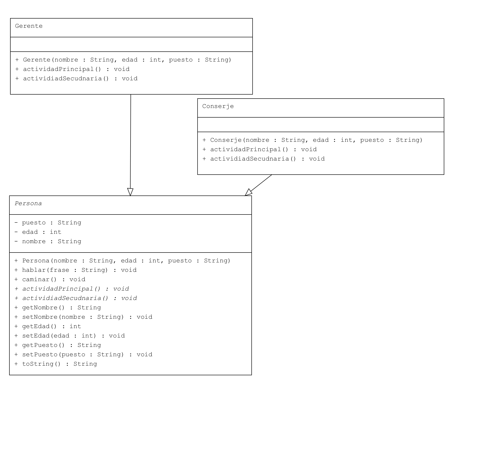

# Parte 4 -  POO | Ignacio CAVALLO
---- 

## Clase 24  | 01/06

### Conceptos Aprendidos  

*En Clase:*

* Principios *S.O.L.I.D.*
*  

>Un clase abstracta es como un **molde de un molde**. Básicamente, un **Inception de Clases**  
> Ignacio Cavallo

*Fuera de clase:*

* Me la voy a pasar estudiando para el exámen de mañana!!
 

### Primera Parte
Se retomó el ejercicio dejado como tarea, ya que muchos de los compañeors no lo hicieron. Entonces hice uno nuevo. Decidí hacer una clase abstracta de Persona, y unas sub clases en función de su puesto de trabajo. El resto del desarrollo está [aquí](###persona)

``` java
/* Persona */
 public void hablar(String frase){
        System.out.println(getNombre() + ": " + frase);
    }

    public void caminar(){
        System.out.println("""
                            Estoy caminando....
                               O
                            / /\\_,               
                             / \\                      
                            /_  /_
                """);
    }

    public abstract  void actividadPrincipal();
    public abstract void actividiadSecudnaria();
/* --------------------------------------------------*/
/*     CONSERJE
*/
    @Override
    public void actividadPrincipal() {
        System.out.println("Mis funciones son: ");
        hablar("Abrir Puerta.");
        hablar("Recibir paquetes");
        System.out.println();
        System.out.println();

    }

    @Override
    public void actividiadSecudnaria() {
        hablar("Vigilar");
        hablar("Controlar ingreso y egreso de Personas");
    }

```

### Segunda Parte.
Abordamos el método S.O.L.I.D. y lo que significa requetiemientos. A su vez, se nos explicó como se diagrama de forma visual una clase. Esta es una implemetnación UML  de el ejercicio anterior.


### Persona

```java

package com.nacho;


public abstract class Persona {
    private String nombre;
    private int edad;
    private String puesto;

    public Persona(String nombre, int edad, String puesto){
        this.nombre = nombre;
        this.edad = edad;
        this.puesto = puesto;

    }

    public void hablar(String frase){
        System.out.println(getNombre() + ": " + frase);
    }

    public void caminar(){
        System.out.println("""
                            Estoy caminando....
                               O
                            / /\\_,               
                             / \\                      
                            /_  /_
                """);
    }

    public abstract  void actividadPrincipal();
    public abstract void actividiadSecudnaria();


    /* Getters and Setters */

    public String getNombre() {
        return nombre;
    }

    public void setNombre(String nombre) {
        this.nombre = nombre;
    }

    public int getEdad() {
        return edad;
    }

    public void setEdad(int edad) {
        this.edad = edad;
    }

    public String getPuesto() {
        return puesto;
    }

    public void setPuesto(String puesto) {
        this.puesto = puesto;
    }

    @Override
    public String toString() {
        return "Soy " + getNombre() + " mi edad es "
                + getEdad() + " y mi trabajo es de "
                + getPuesto();
    }
}

/* Conserje */


public class Conserje  extends Persona{

    public Conserje(String nombre, int edad, String puesto){
        super( nombre,  edad, puesto);

    }

    @Override
    public void actividadPrincipal() {
        System.out.println("Mis funciones son: ");
        hablar("Abrir Puerta.");
        hablar("Recibir paquetes");
        System.out.println();
        System.out.println();

    }

    @Override
    public void actividiadSecudnaria() {
        hablar("Vigilar");
        hablar("Controlar ingreso y egreso de Personas");
    }


}

/* Gerente */


public class Gerente extends Persona{

    public Gerente(String nombre, int edad, String puesto){
        super( nombre,  edad, puesto);

    }

    @Override
    public void actividadPrincipal() {
        hablar("Gerenciar");
        hablar("En realidad, no hago mucho....");


    }

    @Override
    public void actividiadSecudnaria() {
        hablar("Contratar");
        hablar("Despedir");
    }   

    /* Resultado */


    *** Nueva Persona ***
Jan I. Tor: Aloha
Soy Jan I. Tor mi edad es 42 y mi trabajo es de Conserje

            Estoy caminando....
               O
            / /\_,
             / \
            /_  /_

Mis funciones son: 
Jan I. Tor: Abrir Puerta.
Jan I. Tor: Recibir paquetes


Jan I. Tor: Vigilar
Jan I. Tor: Controlar ingreso y egreso de Personas


```