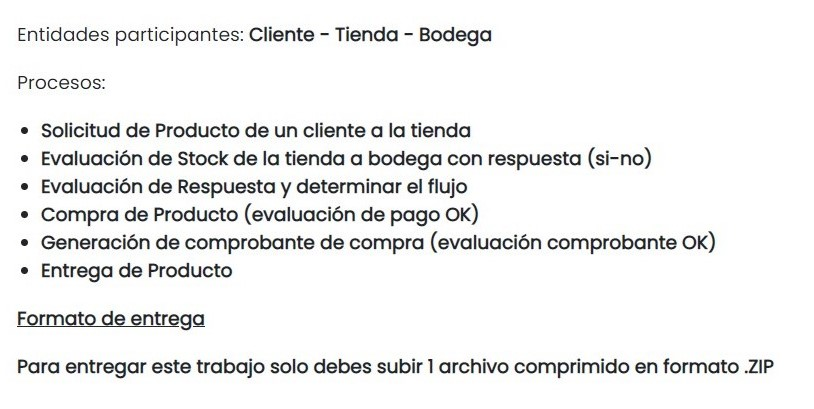
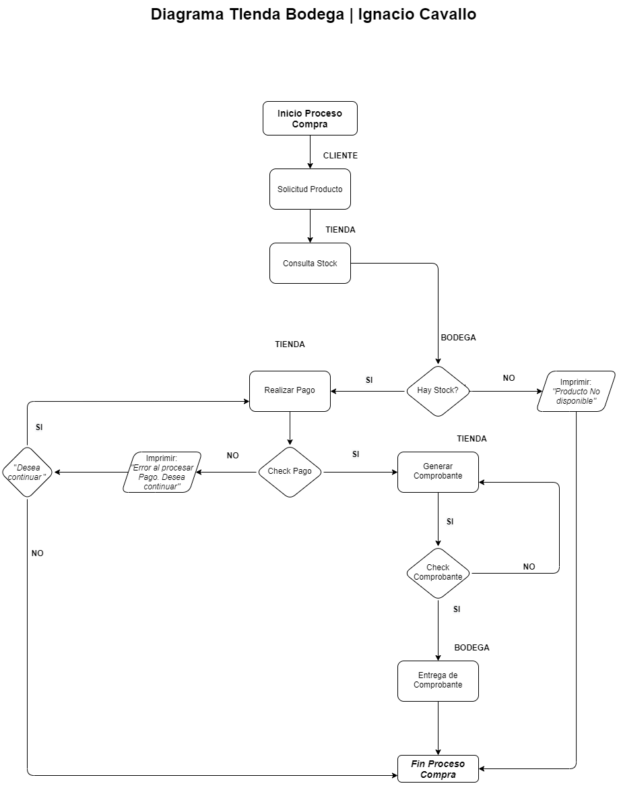

# Módulo 1 - Exámen | Ignacio CAVALLO.

## Introducción
Siguiendo mi línea de trabajo, explicaré como abordé el siguiente ejercicio:  
  
  </br>


</br>  
Algunas consideraciones previas:  

* Intentare resumir al mínimo mi desarrollo, pero si estan interesados en ver toda mi implemetnación, la pueden consultar [aquí](https://github.com/cavigna/modulo_programacion_basica_en_java/tree/main/5%20-%20Examen/TiendaBodega/src/com/nacho). El código continua si es que ven lo siguiente:

 ```java
                /* ................ */
```

* En el resultado el comentario /**/ muestra el resultado del terminal.
* El diagrama está por [acá](##diagrama). O por acá si lo querés ver más [grande](https://github.com/cavigna/modulo_programacion_basica_en_java/blob/a3ca91fedcd63e79ecbc5fc7d457f1bda9ced53e/5%20-%20Examen/imagenes/DiagramaIgnacio.png).
* A continuación se puede ver el [resultado](##resultado). 
* Date una vuelta por acá que está el [desarrollo.](##desarrollo)
* Esta presentación hace una serie de supuestos o  simplificaciones como por ejemplo:  
  * El método de pago es efectivo.	    
  * Supone que los comprobantes serán usados una vez.
  * El uso de el listado de productos en la bodega es funcional, la implenetación se debe desarrollar en mayor profundidad.
  * Me gustaría implementar un HasMap con todos los productos.

## Resultado  
Don [Geralt De Rivia](https://witcher.fandom.com/es/wiki/Geralt_de_Rivia), se vió en la necesidad de reponer algunos de sus  carecterísticos insumos.  


</br>
Por eso se acercó a su Mercader en Novigrad y le solicitó una serie de articulos. Vamos a ver como le va....  

```Java
// Agregamos algunos Productos
        var mutageno = new Producto(1, " Mutágeno Rojo", 50);
        var armaduraOso = new Producto(2, "Armadura Oso", 1500);
        var espadaDePlata = new Producto(3,"Espada de Plata", 250 );


        var bodega = new Bodega(); // Creamos una nueva Bodega
        var tienda = new Tienda("Novigrad", bodega); //Tienda
        // Agregamos unas algunos productos...
        bodega.agregarProducto(espadaDePlata, 5);
        bodega.agregarProducto(mutageno, 10);
        bodega.agregarProducto(armaduraOso, 1);

        

        //Check del Stock Inicial
        bodega.imprimirStock(espadaDePlata);
        bodega.imprimirStock(mutageno);
        bodega.imprimirStock(armaduraOso);
        
        
        /* --- Stock En Bodega ---
    El producto Espada de Plata tiene un stock total de: 5   
    El producto  Mutágeno Rojo tiene un stock total de: 10   
    El producto Armadura Oso tiene un stock total de: 1   
            --- Fin --- */
    var geraltOfRivia = new Cliente("Geralt of Rivia", "42.424242-7", 200)
    
    /* Geralt of Rivia tiene un saldo de $200.0 */ 

```

**HAY STOCK ?**  
El buen Geralt se decide a comprar dos Armaduras de Oso, pero no hay en stock (solo hay una): 

```java
tienda.venta(geraltOfRivia,armaduraOso, 2);
/*
No hay Suficiente Stock Disponible de: 
Armadura Oso

*/
```

**COMPRA EXITOSA**  
Pero si hay unos mutágenos que siempre vienen bien!. Veamos si la compra procede como también los saldos del Mercader como de Geralt.

```java
tienda.venta(geraltOfRivia,mutageno, 2);
      
Comprobante comprobanteVentaMutageno = tienda.generarComprobante(mutageno,2);

tienda.entregaProducto(comprobanteVentaMutageno);
/*
        --- Venta ---

        Cliente: Geralt of Rivia
        Producto:  Mutágeno Rojo
        Cantidad: 2
        Precio: $50.0
        Monto de Total a pagar: $100.0

        El comprobante  n 001 de su compra  Mutágeno Rojoha sido generado
        Gracias por su compra
*/

tienda.imprimirCaja();
geraltOfRivia.imprimirSaldo();

/* 
        En caja hay: $100.0
    El saldo de Geralt of Rivia es de $100.0 */
```  

**COMPROBAR PAGO**

Ahora Geralt quiere comprar una espada, pero ya no tiene saldo suficiente por eso se va matar algunos Mounstros para obtener algo de dinero. Después vuelve y procede a comprar...

```java
 tienda.venta(geraltOfRivia, espadaDePlata, 1);
 /*
    Geralt of Rivia no tiene saldo suficiente
 */

geraltOfRivia.matarMounstros(recompensa = 2500);
/*
    Ya mate el Mounstro!
    Nuevo Saldo de Geralt: $2600.0
*/
tienda.venta(geraltOfRivia, espadaDePlata, 1);
Comprobante comprobanteVentaEspada =
        tienda.generarComprobante(espadaDePlata, 1);
tienda.entregaProducto(comprobanteVentaEspada);
/*
        --- Venta ---

        Cliente: Geralt of Rivia
        Producto: Espada de Plata
        Cantidad: 1
        Precio: $250.0
        Monto de Total a pagar: $250.0

        El comprobante  n 002 de su compra Espada de Plataha sido generado
        Gracias por su compra
        
        *** ENTREGA PRODUCTO ***

        Comprobante n°: 002
        Entrega de producto Espada de Plata

        --- Fin Venta ---
*/
```

**COMPROBAR EXISTENCIAS**
Veamos el listado de comprobantes y si el stock se actualizó con las ventas realizadas. Recordemos que se vendió una espada y dos mutagenos(Originalmente eran 5 y 10).

```JAVA
bodega.imprimirStock(espadaDePlata);
bodega.imprimirStock(mutageno);
bodega.imprimirStock(armaduraOso);
/*
--- Stock En Bodega ---
El producto Espada de Plata tiene un stock total de: 4   
El producto  Mutágeno Rojo tiene un stock total de: 8   
El producto Armadura Oso tiene un stock total de: 1   
 --- Fin ---

*/

tienda.listadoComprobantes();
/*
 --- Listado de Comprobantes Emitidos ---
Comprobante 001 del producto  Mutágeno Rojo
Comprobante 002 del producto Espada de Plata
 --- Fin Listado --- 
 */

```
Y con eso Don Geralt, se va feliz a seguir con sus andanzas. Adios Geralt, que la fuerza te acompañe!.  

</br> 

## Desarrollo## Desarrollo

El problema se puede plantear de la siguiente manera:

>Un cliente quiere comprar un producto en una tienda, la cual debe hacer un check doble de las existencias en bodega como también si el pago del cliente es aceptado. Una vez cumplidos esos requisitos, si el comprobante emitido es válido,  *se procederá a la entrega del producto*.

Por ende decidí aplicar lo aprendido dentro y fuera de clase y desarrollé la lógica en la forma de clases. Estas serán:

* [**Producto.**](###producto)
* [**Bodega.**](###bodega)
* [**Cliente.**](##cliente)
* [**Comprobante.**](###comprobante)
* [**Tienda.**](###tienda)

### Producto

Mi punto de inicio fue crear una clase producto que albergue todas las carecterísticas de los diversos bienes que se pueden encontrar en la Tienda. Los atributos de la misma serán el código, descripción y precio. Este, debe tener un check para valores negativos, por lo  cual desarrollé un Tenary en el atributo. Por último, y no menos importante, decidí que el stock del Producto en sí, sea llevado por esta clase. Esto se debe a simplicidad a la hora de desarrollar el código, aunque mi idea original era mapear el stock con un listado de productos dentro de bodega.  Quedó de la siguiente manera:
```java
public class Producto {
    private int codigo;
    private String descripcion;
    private double precio;
    private int stockProducto;


    public Producto(int codigo, String descripcion, double precio){
        this.codigo = codigo;
        this.descripcion = descripcion;
        this.precio = precio<0 ? 0: precio;
        this.stockProducto = 0;

    } 
    /* ................ */
```

### Bodega

Ahora vamos por la Bodega. Esta almacenará un *ArrayList* de los productos creados. También es necesario crear métodos que agreguen productos, que revisen si hay stock, que imprima ese Stock y por último que permita el retiro del Producto en la cantidad necesaria. Simplemente, hacemos un check si el producto está agregado y si el mismo tiene stock suficiente para la cantidad pedida.

```java
  private final ArrayList<Producto> stock = new ArrayList<>();


    public Bodega() {
    }

    public void agregarProducto(Producto producto, int cantidad) {
        for (var i = 1; i <= cantidad; i++) {
            this.stock.add(producto);
        }
        producto.setStockProducto(producto.getStockProducto() + cantidad);

    }

    public boolean hayStock(Producto producto, int cantidad) {
        return producto.getStockProducto() >= cantidad;

    }


    public void retirarProducto(Producto producto, int cantidad) {
        if (hayStock(producto, cantidad)) {
            producto.setStockProducto(producto.getStockProducto()
                    - cantidad);
        }
    }
                /* ................ */
```

### Cliente  
Esta clase es una simple implenetación de una persona, con el objetivo de poder obtener el saldo de la misma. De esta forma evaluaremos si su pago será válido o no. De todas maneras, le agregué un pequeño método llamado *matarMounstros()* que incrementa su saldo.
```java
public class Cliente {
    private String nombre;
    private String rut;
    private double saldo;

    public Cliente(String nombre, String rut, int saldo) {
        this.nombre = nombre;
        this.rut = rut;
        this.saldo = Math.max(0,saldo);
    }
    /* ................ */

```  

### Comprobante
Esta clase tiene como función crear los comprobantes por cada venta generada. Va estar relacionada con un producto determinado y la cantidad requerida. A su vez llevará un numero de comprobante propio del objeto. De todas formas, el orden secuencial de estos comprobantes irá dentro de Tienda.
```Java

public class Comprobante {
    private int numeroComprobante =1 ;
    private Producto producto;
    private int cantidad;


    public Comprobante(Producto producto, int numeroComprobante, int cantidad) {
        this.numeroComprobante = numeroComprobante;
        this.producto = producto;
        this.cantidad= cantidad;

    }

    public void generarComprobante(){
        System.out.println("El comprobante  n 00" + getNumeroComprobante()
                + " de su compra " + producto.getDescripcion() + "ha sido generado" );
        System.out.println("Gracias por su compra");

/* ................ */
```

### Tienda
Por último, la clase que tendrá la mayor relevancia dentro de este esquema.  La tienda deberá:  

1. Comprobar que la Bodega tenga la cantidad del producto solicitado.

2. Comprobar que el Cliente tenga Saldo suficiente para la operación.  

3. Generar un Comprobante por la venta.  

4. Controlar que el comprobante sea válido.

5. Entregar el Producto.

Por ende para solucionar los dos primeros apartados, creé un método venta que hace el check con bodega y si es así hacer el check del saldo del cliente. Si todo esto se cumple, se procesará la compra, se sumará el monto a la caja de la tienda, se descontará el valor al saldo del cliente  y se generará un comprobante de clase Comprobante que será almacenado en un ArrayList< Comprobante >. Este  será el input para el posterior retiro del producto. En caso de que el comprobante esté dentro de la lista será entregado el producto.

```java
public class Tienda {
    private final String nombre;
    private Bodega bodega;
    private double caja;
    private ArrayList<Comprobante> comprobantes;
    private int nComprobante;


    public Tienda(String nombre, Bodega bodega) {
        this.nombre = nombre;
        this.bodega = bodega;
        this.caja = 0;
        this.comprobantes = new ArrayList<>();
        this.nComprobante = 1;
    }

    public void imprimirCaja() {
        System.out.println("En caja hay: $" + this.caja);
    }


    public void venta(Cliente cliente, Producto producto, int cantidad) {
        double montoVenta = producto.getPrecio() * cantidad;
        if (bodega.hayStock(producto, cantidad)) { // Check Bodega
            if (cliente.getSaldo() >= montoVenta) { //Check Saldo
                /* ................ */
                this.caja += montoVenta;
                cliente.setSaldo(cliente.getSaldo() - montoVenta);


            } else {
                
                System.out.println(cliente.getNombre() + " no tiene saldo suficiente");

            }
        } else {
           
            System.out.println("No hay Suficiente Stock Disponible de: ");


        }
    }

    public Comprobante generarComprobante(Producto producto, int cantidad) {
        var comprobanteGenerado = new Comprobante(producto, nComprobante, cantidad);
        comprobantes.add(comprobanteGenerado); //Add Comprobante
        this.nComprobante++; // ++ n de comprobante
        comprobanteGenerado.generarComprobante(); // Genera desde la clase Comprobante
        return comprobanteGenerado;

    }

    public void listadoComprobantes() {
        
        for (Comprobante c : comprobantes) {
            System.out.println("Comprobante 00" + c.getNumeroComprobante() + " del producto "
                    + c.getProducto().getDescripcion());
        }
        
    }

    public void entregaProducto(Comprobante comprobante) {
        if (comprobantes.contains(comprobante)) {
            System.out.println(" ");
            System.out.println(" *** ENTREGA PRODUCTO ***");
            System.out.println();
            System.out.println("Comprobante n°: 00" + comprobante.getNumeroComprobante());
            System.out.println("Entrega de producto " + comprobante.getProducto().getDescripcion());
            System.out.println("");
            bodega.retirarProducto(comprobante.getProducto(), comprobante.getCantidad());


        } else {

            System.out.println("Por favor dirijase a Atención al Cliente.");

        }


    }
```


## Diagrama


